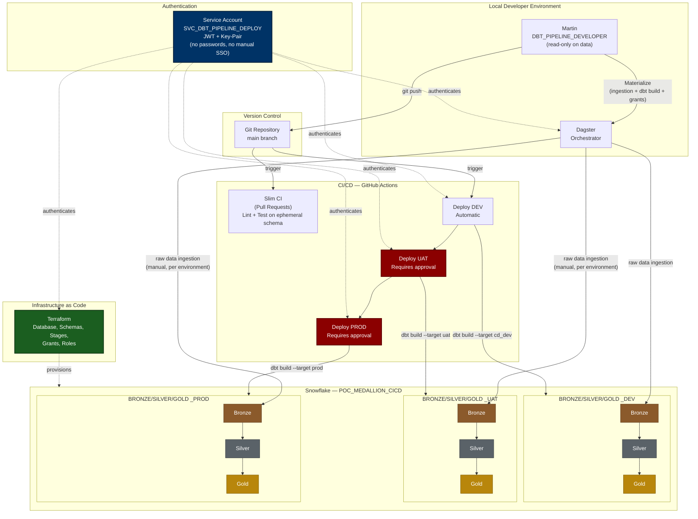

## ADD TITLE

### Architecture
# Pipeline Architecture — Medallion CI/CD POC




### Flow
```Text
                  ┌──────────────────────────────────────────────┐
                  │              SNOWFLAKE STAGE                 │
                  │   (@POC_MEDALLION_CICD.BRONZE_DEV.RAW_STAGE) │
                  └──────────────────────┬───────────────────────┘
                                         │
                                         │ (1) Dagster Asset: COPY INTO
                                         ▼
                  ┌──────────────────────────────────────────────┐
                  │              RAW_CUSTOMERS                   │
                  │       (Tabla Landing en BRONZE_DEV)          │
                  └──────────────────────┬───────────────────────┘
                                         │
                                         │ (2) Dagster Asset: dbt build
                                         ▼
 ┌───────────────────────────────────────────────────────────────────────────────┐
 │                                 dbt PIPELINE                                  │
 │                                                                               │
 │  [stg_bronze_customers] ──► [silver_customers] ──► [gold_dim_customers]       │
 │          │                         │                        │                 │
 │          ▼                         ▼                        ▼                 │
 │     dbt test (Bronze)         dbt test (Silver)         dbt test (Gold)       │
 │                                                             │                 │
 │                                                             ▼                 │
 │                                                  [gold_country_metrics]       │
 │                                                             │                 │
 │                                                             ▼                 │
 │                                                    Singular Data Test         │
 └───────────────────────────────────────────────────────────────────────────────┘
```
